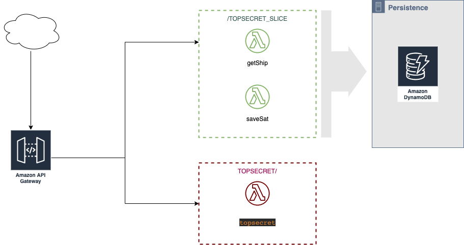

# Challenge Operación Quasar
Solucion propuesta para el challenge, para el mismo utilizo
[serverless Famework](https://www.serverless.com/),
[serverless-offline](https://github.com/dherault/serverless-offline) plugin y
[serverless-dynamodb-local](https://github.com/99xt/serverless-dynamodb-local).
Diagrama:


## Setup
Despues de clonar el repo

```bash
npm install
```

## Ejecutar servicio offline

```bash
serverless offline start
```
Luego de ejecutar el servicio offline(emula Api Gateway y Lambda)
se puede enviar los diferentes request para su prueba (Esto se encuentra integrado tambien en los test e2e)
el archivo request.http contiene las consultas (formato de intelliJ)
dejo ejemplos de curl 
```bash
curl -X POST --location "http://localhost:3000/dev/topsecret" \
    -H "Content-Type: application/json" \
    -d "{
        \"satellites\": [
             {
               \"name\": \"kenobi\",
               \"distance\": 100.0,
               \"message\": [\"este\", \"\", \"\", \"mensaje\", \"\"]
             },
          {
            \"name\": \"skywalker\",
            \"distance\": 115.5,
            \"message\": [\"\", \"es\", \"\", \"\", \"secreto\"]
          },
          {
            \"name\": \"sato\",
            \"distance\": 142.7,
            \"message\": [\"este\", \"\", \"un\", \"\", \"\"]
          }
        ]
        
        }"
```

## Ejecutar test Unitarios
```bash
npm test
```

## Ejecutar test integracion
Aqui solo provee un ejemplo sencillo
```bash
npm run e2e
```

## Despliegue en AWS
El servicio puede deplegarse en AWS teniendo seteado sus credenciales locales y luego ejecutando
```bash
serverless deploy
```

## Endpoints
* POST - https://quhtf0bqs3.execute-api.us-east-1.amazonaws.com/dev/topsecret
* GET - https://quhtf0bqs3.execute-api.us-east-1.amazonaws.com/dev/topsecret_slice
* POST - https://quhtf0bqs3.execute-api.us-east-1.amazonaws.com/dev/topsecret_slice/{satellite_name}
